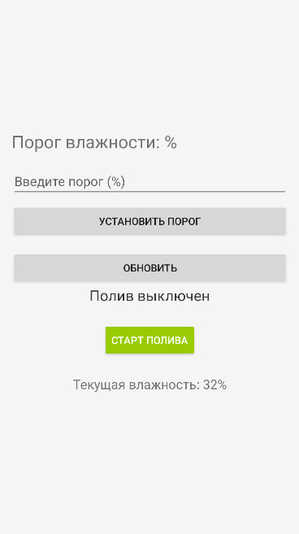
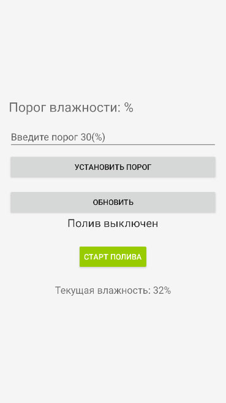
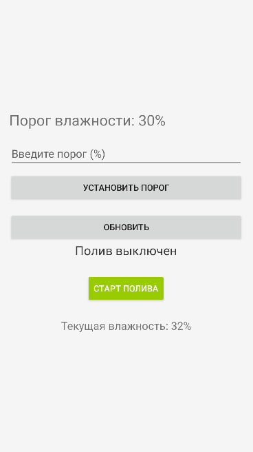
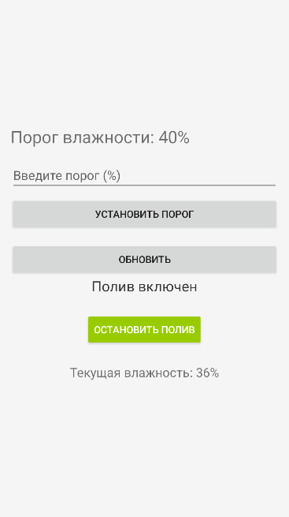

# Автор:
  КОРОТАЕВ СЕРГЕЙ НИКОЛАЕВИЧ  
# Приложение Android для мониторинга и управления системой автоматического полива

## Оглавление

- [Описание проекта](#описание-проекта)  
  - [1. Назначение](#1-назначение)  
  - [2. Пример работы](#2-пример-работы)  
- [Технологии](#Технологии) 
- [Потенциал для развития](# Возможности для развития)

## Описание проекта

### 1. Назначение

Это Android-приложение предназначено для мониторинга уровня влажности почвы и управления системой автоматического полива.  

### 2. Пример работы

Главный экран (`MainActivity`) содержит следующие элементы:

- **Текущий уровень влажности почвы**.
- **Порог срабатывания** (ввод значения пользователем).
- **Кнопка установки нового порога**.
- **Кнопка ручного запуска или остановки полива**.
- **Кнопка обновления данных**.
- **Отображение текущего состояния полива** (включен/выключен).

Пример пользовательского интерфейса:

Ввод порога для полива:

При понижении влажности ниже установленного порога, включается полив:

# Технологии
### Языки программирования:
- Kotlin 
- Python 

# Возможности для развития

Возможные направления расширения функционала:

### 1. История влажности (с графиком)
- Сохранение данных о влажности и отображение графика за день/неделю/месяц.

### 2. Уведомления
- Отправка push-уведомлений при превышении или снижении уровня влажности.

